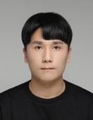
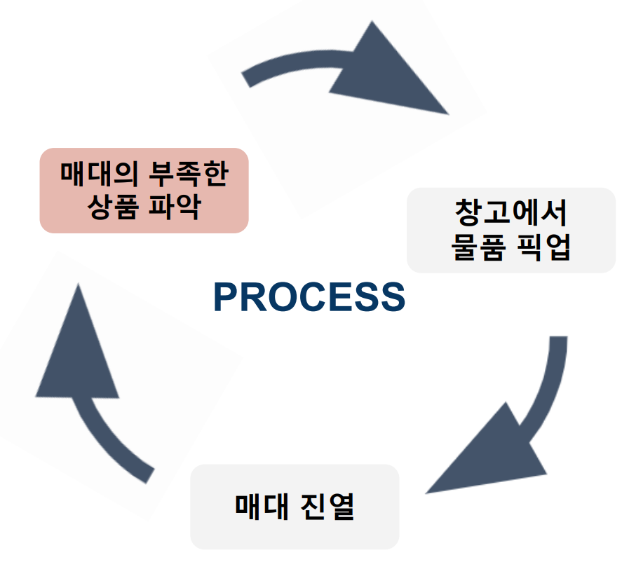
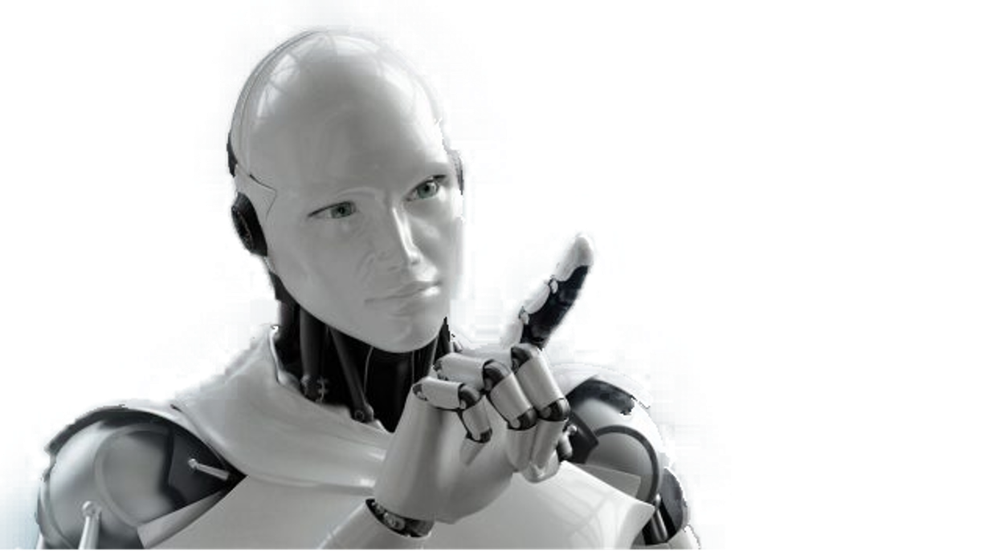

# 🍜 매대 결품 감지 시스템

## 🤼 팀 소개

CV-12 TEAM YOLO


|김승현_T3038|노창현_T3074|최용원_T3219|최진아_T3225|최홍록_T3228|
|:-:|:-:|:-:|:-:|:-:|
|<a href="https://github.com/KimSeungHyun1217"></a>|<a href="https://github.com/Rohchanghyun"></a>|<a href="https://github.com/chldyddnjs"></a>|<a href="https://github.com/mango-jina"></a>|<a href="https://github.com/ChoiHongrok"></a>|


## 🕶️ 프로젝트 소개


- 재고파악 자동화 및 프로세스 효율화를 위한 Computer Vision 시스템
- 모든 매장에서 매대 품목을 관리하는 시스템으로 사용할 수 있음

### 📺 Demo

[https://www.youtube.com/watch?v=wukjFmrvYi8](https://www.youtube.com/watch?v=wukjFmrvYi8)

### 📝 Test

```python
Python Video_test.py --video_name {TestVideo 경로} --output_name {Output Video name}
```

### 📁 Dataset

**Train** / **Validation Image**

- [Train](https://drive.google.com/drive/folders/1ovW3LX2MdJcSPUlFFlB9IXNZWKJFzAdD?usp=sharing)
- [Validation](https://drive.google.com/drive/folders/1rymW4U1QRRV242O1o2wnktA7cUUt_Eqo?usp=sharing)

**Test**

- [Image](https://drive.google.com/drive/folders/1qmnL2lf2FHrFvSTaEln-eABApLqQfiPQ?usp=sharing)
- [Test_Video](https://drive.google.com/drive/folders/1bq-sye22NnQTo-bNx3IOmUKYyZrtXRLm?usp=sharing)

### 🤔 Model

<!--  -->


| Task | Model | Performance |
| --- | --- | --- |
| Object detection | YOLOv5 | mAP50: 0.9915 |
| Classification | ResNet18 | accuracy: 0.966 |
| 결품감지 | YOLO+RESNET18+SSIM | mAP50: 0.45 |

### 🏗️ System Architecture


## 🗃️ Work directory

```bash
|-- README.md
|-- Video_test.py
|-- backend
|   |-- Send_To_Video.py
|   |-- backend_flask_detector.py
|-- dataset
|   |-- README.md
|   |-- images
|   |-- instances_Test.json
|   |-- instances_Train.json
|   |-- instances_Validation.json
|-- evaluation
|   |-- mAP.ipynb
|-- front
|   |-- front_table.py
|   |-- result.csv
|-- modules
|   |-- Human_detect.py
|   |-- calcIou.py
|   |-- changeDetector.py
|   |-- classification.py
|   |-- model.py
|   |-- outDetection.py
|   |-- ramen_detect.py
|   |-- rgb_simularity.py
|   |-- utils.py
|-- requirements.txt
|-- train
|   |-- classification
|   |-- yolov5
|-- weights
|   |-- classification_all.pth
|   |-- outDetector.pth
|   |-- ramen_best.pt
```

## ⚙️ Requirements

```bash
yolov5==6.1.2
streamlit==1.9.0
streamlit-webrtc==0.37.0
torchvision==0.8.1
scikit-image==0.19.2
albumentations==1.1.0
flask==2.1.2
torch==1.11.0
uvicorn==0.17.6
```
